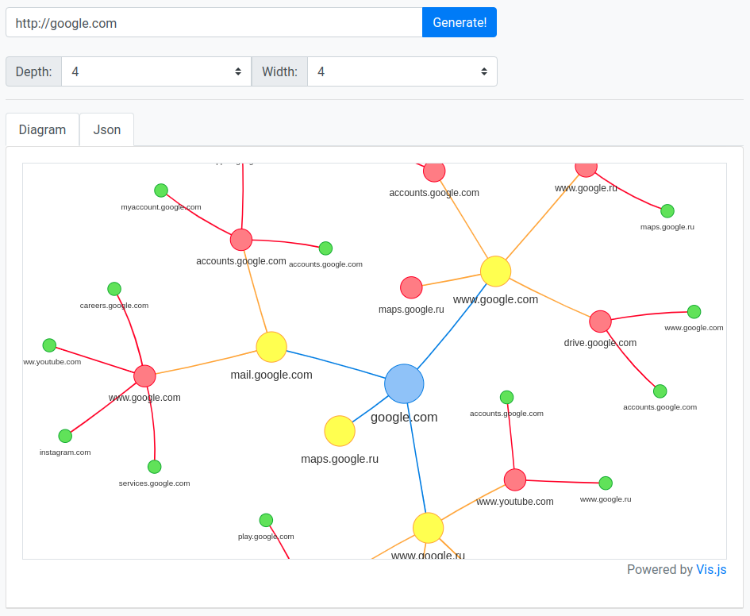

# Links Mapper

:bar_chart: Small web service for generating tree-like structures of a website connections

## Running/Installation:

- #### Docker
  If you have [docker](https://www.docker.com/) and [docker-compose](https://docs.docker.com/compose/) installed on your machine - you can simply run `docker-compose up` from project's directory and running application will wait you on `http://localhost:80` or `http://0.0.0.0:80`

- #### Manual

1. Make sure you have [go](https://golang.org/) installed on your machine. This project was made on `1.13.4`
2. Run `go get ./..` to get all project dependencies
3. Start the application with `go run linksmap.go`

    That's it, the server will be available on `http://localhost:8080`

> Issues and contributions are welcome!
